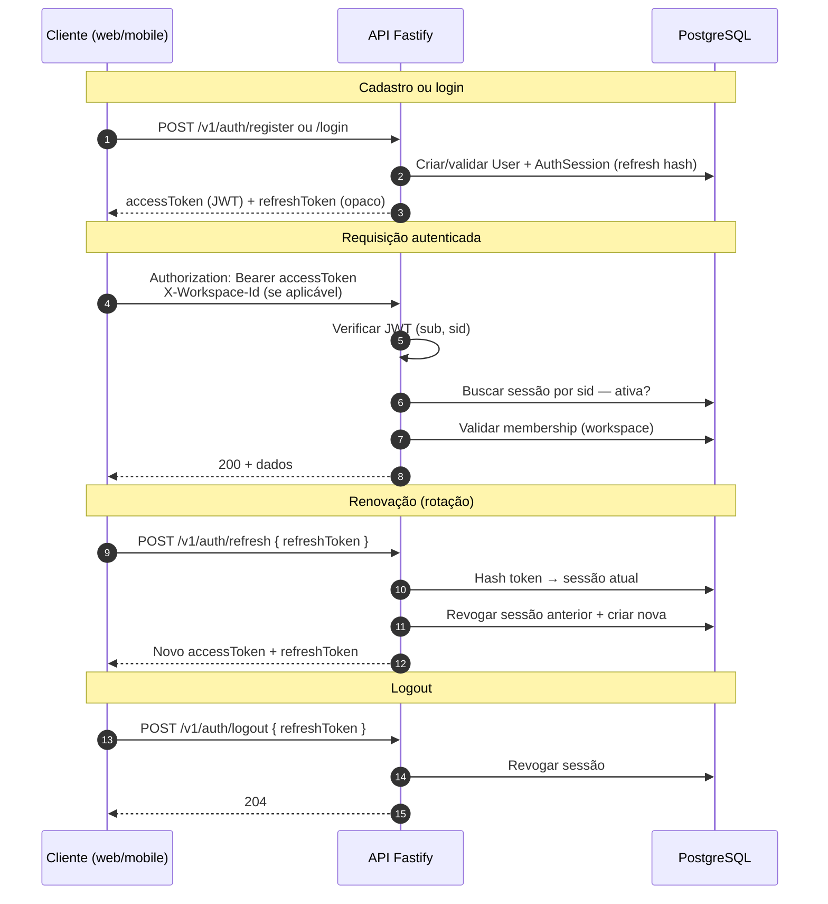

# Fluxo de autenticação

Autenticação da etapa 2: JWT de acesso curto + refresh opaco com rotação.

## Endpoints

| Método | Rota                | Auth   | Descrição                              |
| ------ | ------------------- | ------ | -------------------------------------- |
| POST   | `/v1/auth/register` | —      | Cadastro + workspace pessoal + tokens  |
| POST   | `/v1/auth/login`    | —      | Login + tokens                         |
| POST   | `/v1/auth/refresh`  | —      | Rotaciona refresh e emite novos tokens |
| POST   | `/v1/auth/logout`   | —      | Revoga sessão do refresh informado     |
| GET    | `/v1/auth/me`       | Bearer | Dados do usuário autenticado           |

## Detalhes

- Access token: JWT HS256, claims `sub` (userId) e `sid` (sessionId).
- Refresh token: 64 caracteres hex; apenas SHA-256 persistido.
- Após refresh, o refresh token **anterior** invalida imediatamente.

Ver [ADR-009](../adr/ADR-009-auth-tokens-jwt-and-opaque-refresh.md) e [ADR-012](../adr/ADR-012-refresh-token-rotation.md).
