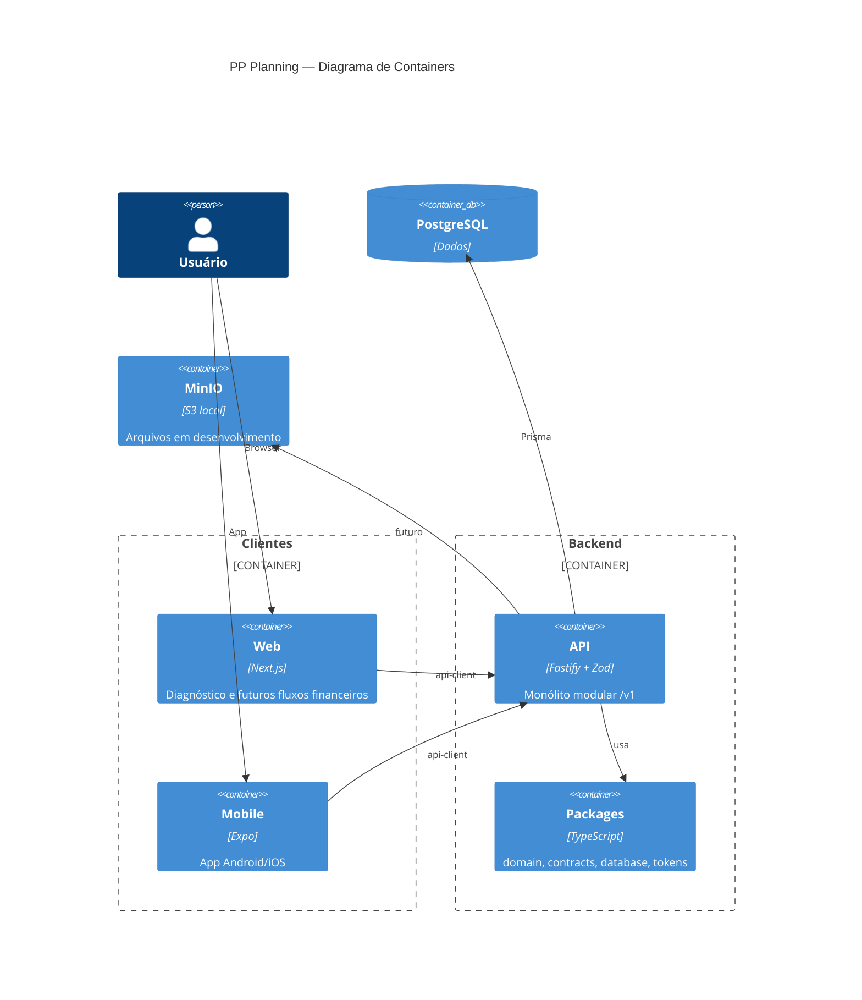

# Diagrama C4 — Containers

```mermaid
C4Container
  title PP Planning — Diagrama de Containers

  Person(user, "Usuário")

  Container_Boundary(clients, "Clientes") {
    Container(web, "Web", "Next.js", "Diagnóstico e futuros fluxos financeiros")
    Container(mobile, "Mobile", "Expo", "App Android/iOS")
  }

  Container_Boundary(backend, "Backend") {
    Container(api, "API", "Fastify + Zod", "Monólito modular /v1")
    Container(packages, "Packages", "TypeScript", "domain, contracts, database, tokens")
  }

  ContainerDb(postgres, "PostgreSQL", "Dados")
  Container(minio, "MinIO", "S3 local", "Arquivos em desenvolvimento")

  Rel(user, web, "Browser")
  Rel(user, mobile, "App")
  Rel(web, api, "api-client")
  Rel(mobile, api, "api-client")
  Rel(api, packages, "usa")
  Rel(api, postgres, "Prisma")
  Rel(api, minio, "futuro")
```
