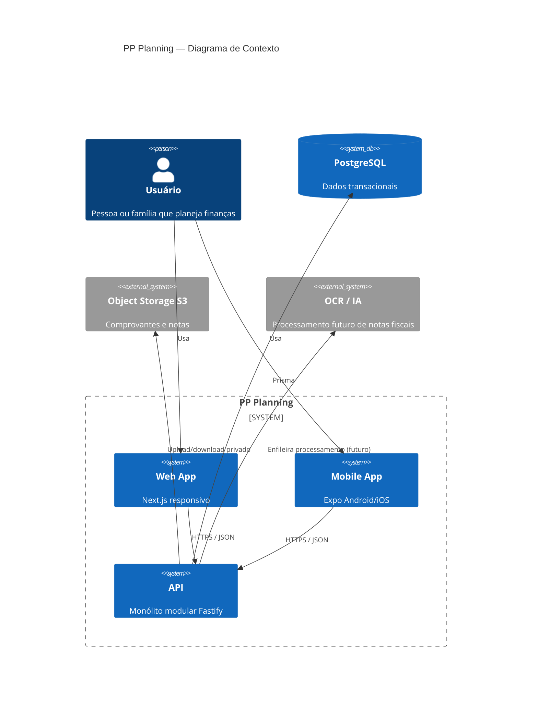

# Diagrama C4 — Contexto

## Visão textual

Usuários acessam o PP Planning via web ou mobile. Ambos consomem exclusivamente a API. A API persiste em PostgreSQL, armazena arquivos em storage S3-compatible e, no futuro, integra um serviço de OCR/IA para leitura de notas com revisão humana.
