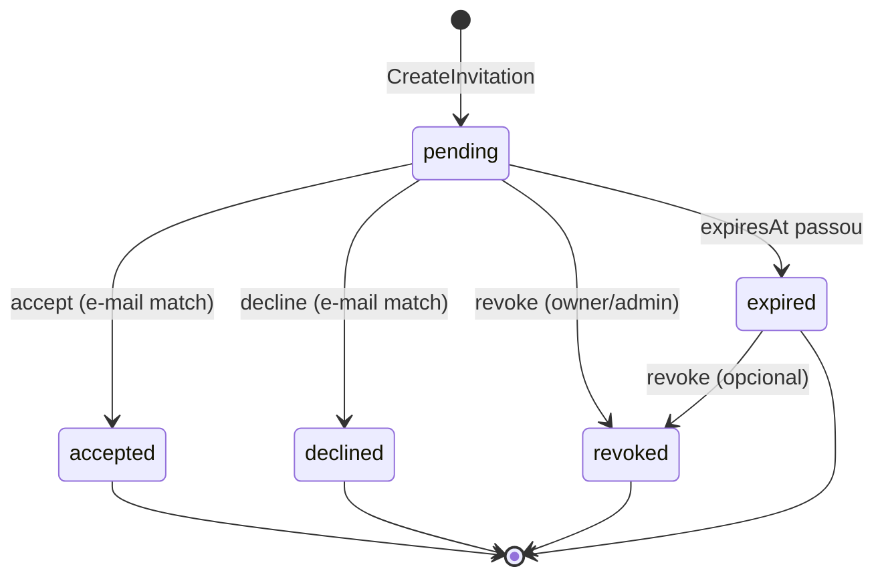
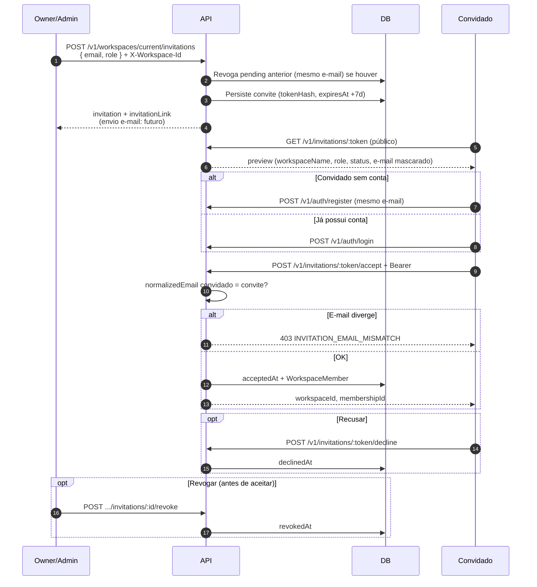

# Fluxo de convite

Ciclo de vida completo de um convite de workspace.

Status **derivado** de timestamps (`acceptedAt`, `declinedAt`, `revokedAt`, `expiresAt`) — ver domínio `WorkspaceInvitation.status()`.

## Sequência detalhada

## Validações principais

| Etapa | Regra |
|-------|--------|
| Criar | E-mail não pode já ser membro ativo |
| Criar | Admin não convida owner/admin |
| Aceitar | Conta autenticada com e-mail do convite |
| Aceitar | Convite pending e não expirado |
| Preview | Token válido (hash encontrado) |

## E-mail (estratégia futura)

Nesta etapa a API **retorna** `invitationLink` uma vez na criação. Integração futura:

- Template transacional com link `{WEB_URL}/convites/{token}`
- Sem reexpor token raw em listagens (apenas hash no banco)
- Reenvio = novo convite (revoga pendente anterior)

Ver [ADR-013](../adr/ADR-013-shared-workspaces-and-invitations.md).
