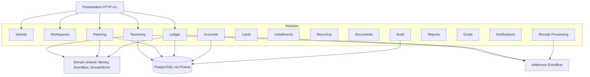

# Módulos internos da API

## Módulo de exemplo implementado

**Taxonomy** (parcial): entidade `Category`, VO `CategoryName`, `CreateCategory`, repositório Prisma + in-memory, rotas `POST/GET /v1/categories`.
