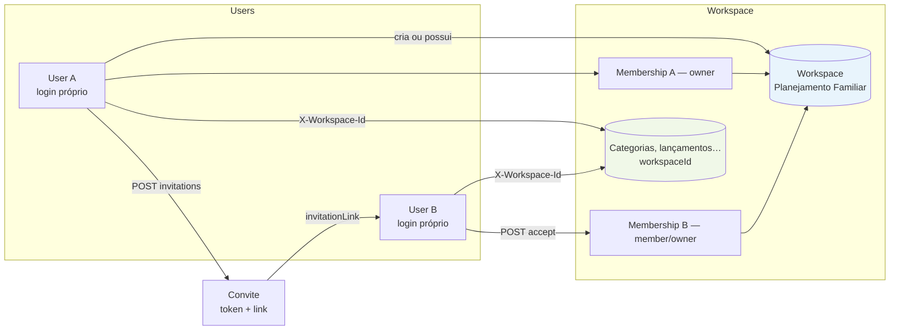
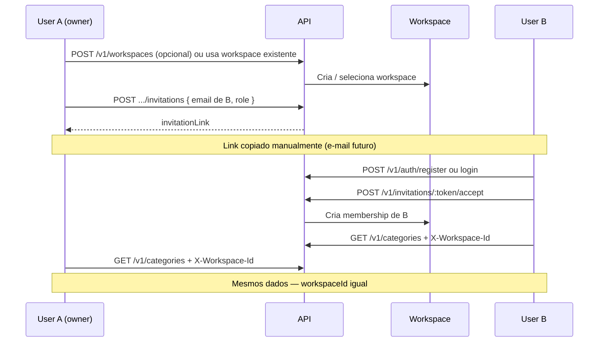

# Fluxo de workspace compartilhado

Visão de alto nível: User A convida User B para o mesmo workspace e ambos acessam dados compartilhados.

## Sequência resumida

## Princípios

- **Sem conta conjunta**: A e B são usuários distintos.
- **Dados no workspace**: propriedade lógica via `workspaceId`.
- **Contexto por header**: cada cliente envia `X-Workspace-Id` do workspace compartilhado.
- **Múltiplos owners**: B pode ser convidado/promovido a `owner`.

Ver [ADR-013](../adr/ADR-013-shared-workspaces-and-invitations.md).
