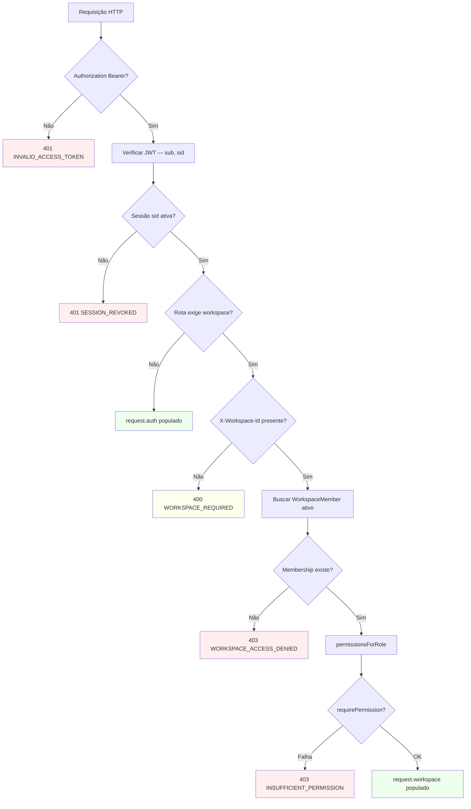

# Resolução de workspace

Como a API determina o contexto de workspace em cada requisição.

## Rotas por contexto

### Sem `X-Workspace-Id`

- `/v1/auth/*`
- `GET /v1/workspaces` — lista memberships do usuário
- `POST /v1/workspaces` — cria workspace (caller vira owner)
- `GET /v1/invitations/:token` — preview público
- `POST /v1/invitations/:token/accept|decline` — exige auth, não workspace header

### Com `X-Workspace-Id` obrigatório

- `/v1/workspaces/current/*` (detalhe, membros, convites, leave)
- Rotas de domínio scoped (ex.: `/v1/categories`)

## Cliente

O `@pp-planning/api-client` injeta o header quando `getWorkspaceId()` retorna um UUID. O valor deve vir da listagem `GET /v1/workspaces` ou do workspace retornado no register.

Ver [ADR-010](../adr/ADR-010-x-workspace-id-header.md).
